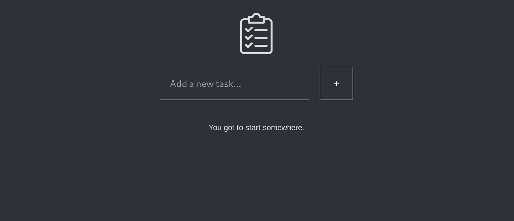

# BasicToDo

|**Description**|
|:---|
|Basic task manager|
|**Dependencies**|
|`"core-js": "^3.6.5"` `"vue": "^2.6.11"` `"node-sass": "^4.14.1"` `"sass-loader": "^10.0.2"`|
|**Setup** (via `npm`)|
|`~$ npm install` to install dependencies `~$ npm run serve` to run a local instance|
|**Demo**|
||
